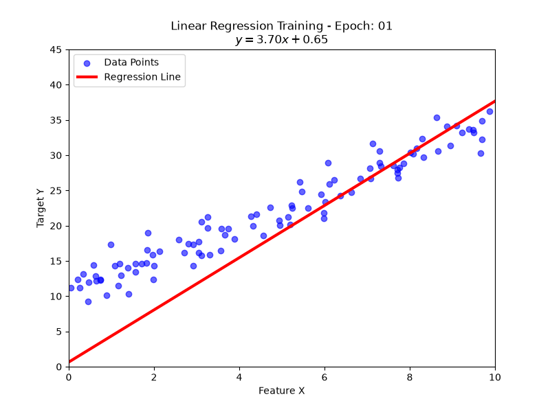
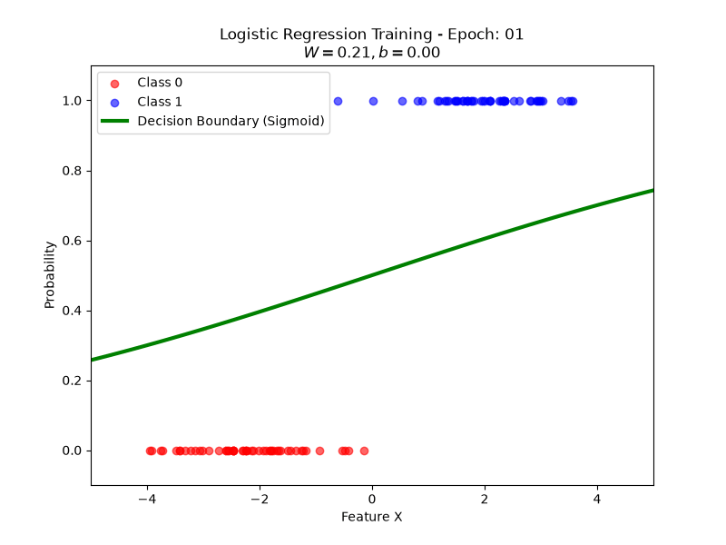
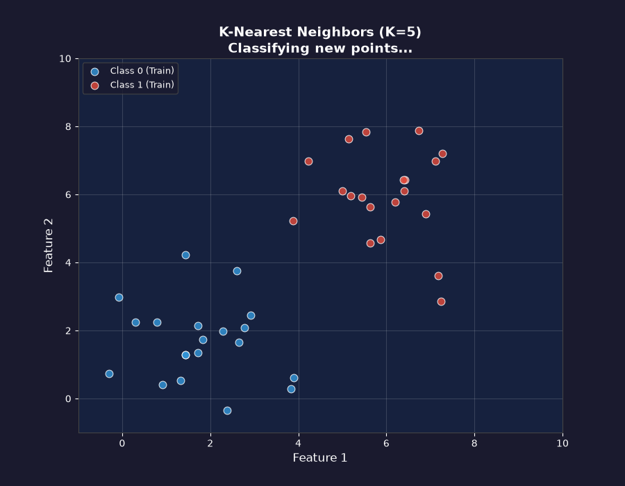
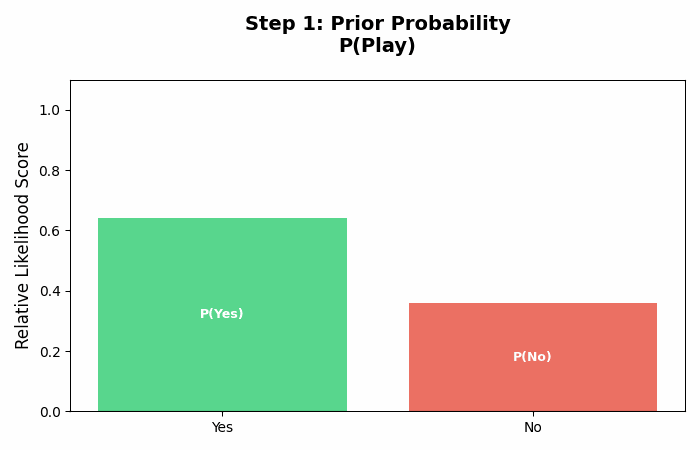
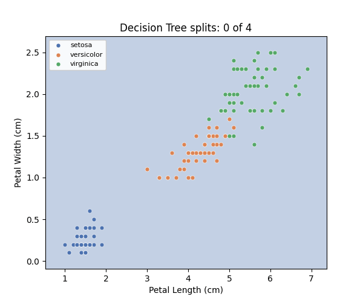
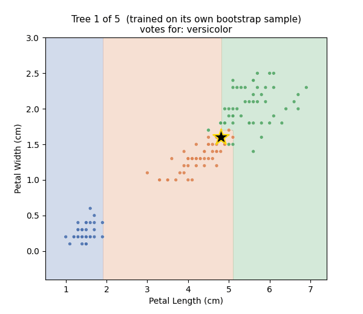
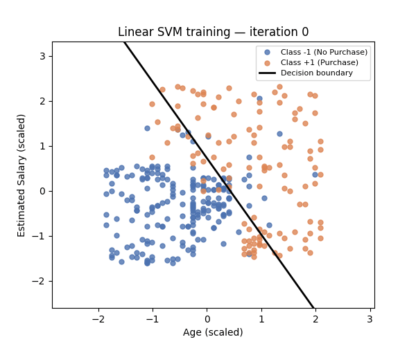
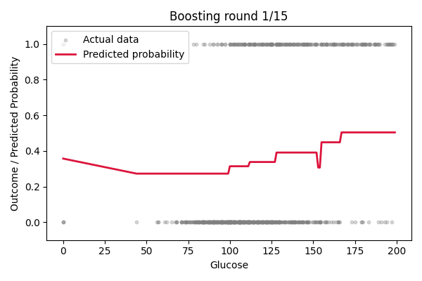
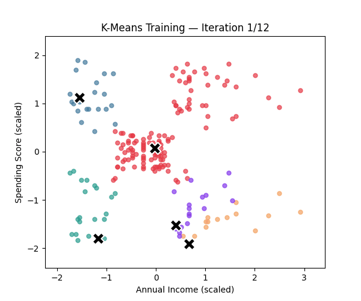

<div align="center">

# 🧠 Machine Learning Algorithms from Scratch

**Building classic ML algorithms from the ground up using only Python and NumPy — no scikit-learn, no shortcuts.**

[](https://www.python.org/)
[](https://jupyter.org/)
[](https://numpy.org/)
[](https://opensource.org/licenses/MIT)

</div>

---

## 📖 Description

This repository is a hands-on collection of **classic machine learning algorithms implemented entirely from scratch** in Python. Every algorithm — from Linear Regression to XGBoost — is built step-by-step using only fundamental libraries like **NumPy** and **Pandas**, giving you full visibility into the math, the logic, and the learning process behind each model.

Each notebook includes:

- **Clear mathematical explanations** of the underlying algorithm
- **From-scratch Python implementations** (no calls to `sklearn.fit()`)
- **Animated GIF visualizations** showing the algorithm learning in real time
- **Evaluation metrics** to measure model performance

Whether you're a student learning ML fundamentals, a developer preparing for interviews, or an engineer who wants to truly understand what happens inside the black box — this repo is for you.

---

## 📑 Table of Contents

- [Key Features](#-key-features)
- [Algorithms Included](#-algorithms-included)
- [Visualizations](#-visualizations)
- [Datasets Used](#-datasets-used)
- [Project Structure](#-project-structure)
- [Getting Started](#-getting-started)
- [Requirements](#-requirements)
- [How to Run](#-how-to-run)

---

## ✨ Key Features

| Feature | Description |
|---|---|
| 🔢 **Pure NumPy Implementations** | Every algorithm is coded from scratch — no high-level ML libraries |
| 📓 **Interactive Notebooks** | Well-documented Jupyter Notebooks with markdown explanations alongside code |
| 🎞️ **Animated Visualizations** | GIF animations showing each algorithm's training process in real time |
| 📊 **Real Datasets** | Trained and evaluated on well-known datasets (Iris, Diabetes, etc.) |
| 🧮 **Math-First Approach** | LaTeX-rendered equations explaining the theory before diving into code |
| 📁 **Two Versions** | Root-level notebooks (v1) for quick exploration, and polished `v2 algorithms/` for deep dives |

---

## 🤖 Algorithms Included

| # | Algorithm | Type | Notebook (v2) |
|---|---|---|---|
| 1 | **Linear Regression** | Supervised — Regression | [`Linear_Regression.ipynb`](v2%20algorithms/Linear_Regression.ipynb) |
| 2 | **Logistic Regression** | Supervised — Classification | [`logistic_regression.ipynb`](v2%20algorithms/logistic_regression.ipynb) |
| 3 | **K-Nearest Neighbors (KNN)** | Supervised — Classification | [`KNN_Classification.ipynb`](v2%20algorithms/KNN_Classification.ipynb) |
| 4 | **Naive Bayes** | Supervised — Classification | [`naive_bayes.ipynb`](v2%20algorithms/naive_bayes.ipynb) |
| 5 | **Decision Tree** | Supervised — Classification | [`Decision_Tree.ipynb`](v2%20algorithms/Decision_Tree.ipynb) |
| 6 | **Random Forest** | Supervised — Ensemble | [`random_forest.ipynb`](v2%20algorithms/random_forest.ipynb) |
| 7 | **Support Vector Machine (SVM)** | Supervised — Classification | [`SVM_From_Scratch.ipynb`](v2%20algorithms/SVM_From_Scratch.ipynb) |
| 8 | **XGBoost** | Supervised — Ensemble (Boosting) | [`xgboost_from_scratch.ipynb`](v2%20algorithms/xgboost_from_scratch.ipynb) |
| 9 | **K-Means Clustering** | Unsupervised — Clustering | [`kmeans_from_scratch.ipynb`](v2%20algorithms/kmeans_from_scratch.ipynb) |

---

## 🎞️ Visualizations

Each algorithm comes with an animated GIF that shows the model learning on real data. These visualizations are generated from within the notebooks themselves.

### Linear Regression
> Gradient descent optimizing the best-fit line through the data, step by step.



---

### Logistic Regression
> The sigmoid decision boundary shifting during training to separate two classes.



---

### K-Nearest Neighbors (KNN)
> Classifying a new data point by finding its k nearest neighbors and taking a majority vote.



---

### Naive Bayes
> Probabilistic classification using Bayes' theorem with class-conditional distributions.



---

### Decision Tree
> Recursive splits on features divide the feature space into pure class regions.



---

### Random Forest
> An ensemble of decision trees voting together for a more robust prediction.



---

### Support Vector Machine (SVM)
> Finding the maximum-margin hyperplane and identifying support vectors.



---

### XGBoost
> Sequential boosting rounds — each new tree corrects errors from the previous ones.



---

### K-Means Clustering
> Centroids iteratively shift toward cluster centers as points get reassigned.



---

## 📂 Datasets Used

All datasets are stored in the [`Data_SET/`](Data_SET/) directory.

| Dataset | File | Description | Typical Use Case |
|---|---|---|---|
| **Salary Data** | `Salary_Data.csv` | Years of experience vs. salary | Linear Regression |
| **Social Network Ads** | `Social_Network_Ads.csv` | User demographics & purchase decisions | Logistic Regression, KNN, SVM |
| **Iris** | `Iris.csv` | Flower species with petal/sepal measurements | KNN, Decision Tree, Random Forest |
| **Diabetes** | `diabetes.csv` | Medical diagnostic measurements | Naive Bayes, XGBoost |
| **Play Tennis** | `play_tennis.csv` | Weather conditions for tennis decisions | Decision Tree (categorical) |
| **Mall Customers** | `Mall_Customers.csv` | Customer spending scores & income | K-Means Clustering |
| **General Data** | `data.csv` | Multi-purpose dataset | Various algorithms |

---

## 🗂️ Project Structure

```
ml algorithms from scratch/
│
├── 📂 Data_SET/                        # Datasets used across notebooks
│   ├── data.csv
│   ├── diabetes.csv
│   ├── Iris.csv
│   ├── Mall_Customers.csv
│   ├── play_tennis.csv
│   ├── Salary_Data.csv
│   └── Social_Network_Ads.csv
│
├── 📂 GIF/                             # Animated visualizations for each algorithm
│   ├── decision_tree.gif
│   ├── kmeans.gif
│   ├── knn.gif
│   ├── linear_regression.gif
│   ├── logistic_regression.gif
│   ├── naive_bayes.gif
│   ├── random_forest.gif
│   ├── svm.gif
│   └── xgboost.gif
│
├── 📂 v2 algorithms/                   # ✅ Polished, from-scratch implementations
│   ├── Linear_Regression.ipynb
│   ├── logistic_regression.ipynb
│   ├── KNN_Classification.ipynb
│   ├── naive_bayes.ipynb
│   ├── Decision_Tree.ipynb
│   ├── random_forest.ipynb
│   ├── SVM_From_Scratch.ipynb
│   ├── xgboost_from_scratch.ipynb
│   └── kmeans_from_scratch.ipynb
│
├── 📓 K-Nearest Neighbors .ipynb       # Root-level notebooks (earlier versions)
├── 📓 Linear Regression.ipynb
├── 📓 Linear_Regression.ipynb
├── 📓 Logistic Regression.ipynb
├── 📓 Naive Bayes.ipynb
│
└── 📄 README.md                        # ← You are here
```

> **Note:** The `v2 algorithms/` folder contains the **latest and most complete** implementations. The root-level notebooks are earlier drafts kept for reference.

---

## 🚀 Getting Started

### Prerequisites

- **Python 3.8+**
- **Jupyter Notebook** or **JupyterLab**

### Requirements

Install the required Python packages:

```bash
pip install numpy pandas matplotlib jupyter
```

These are the core libraries used across all notebooks:

| Package | Purpose |
|---|---|
| `numpy` | Core numerical computations (all algorithms) |
| `pandas` | Data loading and manipulation |
| `matplotlib` | Plotting and GIF generation |
| `jupyter` | Running the interactive notebooks |

---

## ▶️ How to Run

1. **Clone the repository**

   ```bash
   git clone https://github.com/<your-username>/ml-algorithms-from-scratch.git
   cd ml-algorithms-from-scratch
   ```

2. **Install dependencies**

   ```bash
   pip install numpy pandas matplotlib jupyter
   ```

3. **Launch Jupyter Notebook**

   ```bash
   jupyter notebook
   ```

4. **Open any notebook**

   Navigate to the `v2 algorithms/` folder in the Jupyter file browser and open the algorithm you want to explore. Run cells sequentially (top to bottom) using `Shift + Enter`.

5. **Experiment!**

   Each notebook is self-contained — tweak hyperparameters like the learning rate, number of neighbors, or tree depth and watch how the algorithm's behavior changes.

---

## 🙌 Acknowledgments

- Datasets sourced from [Kaggle](https://www.kaggle.com/) and the [UCI Machine Learning Repository](https://archive.ics.uci.edu/ml/index.php)
- Inspired by the belief that **you don't truly understand an algorithm until you can code it from scratch**

---

<div align="center">

**⭐ If you found this helpful, consider giving the repo a star!**

Made with ❤️ and NumPy

</div>
